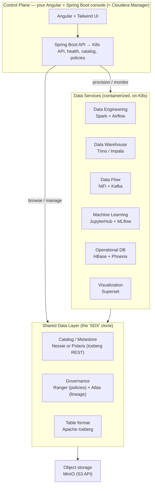

# Open Data Platform — a self-hostable mini-CDP for learning

A Kubernetes-native, fully open-source platform that mirrors Cloudera Data Platform (CDP)
in *shape*, so learners build it, run it, and use the labs to both master the open data
stack and prepare for real Cloudera certifications.

Working name: `@gridatek/open-data-platform` (alt codenames: `openruntime`, `lakeforge`).

---

## Quickstart (one command)

The docker-compose laptop subset brings up the whole stack:

```bash
./bootstrap.sh          # or: make all   (Windows: .\bootstrap.ps1)
make seed               # write the demo Iceberg table
```

| | URL |
|---|---|
| Console (control plane) | http://localhost:8090/api/services · web http://localhost:4200 |
| Superset / Airflow / MLflow | :8088 · :8082 · :5000 |
| Ranger / Atlas / NiFi | :6080 · :21000 · :8095/nifi |

Lighter starts: `make core` (just the lakehouse), `make governance`, `make services`.
Then work the [labs](labs/). For Kubernetes, see the umbrella chart in
[`platform/umbrella`](platform/umbrella/). Each phase is proven by a workflow in
[`.github/workflows`](.github/workflows/). To run it on a real cluster, see
[docs/production.md](docs/production.md).

---

## 1. The core idea (what "follows Cloudera" actually means)

Modern CDP is not "Hadoop". It is two layers:

1. **A shared data + governance layer** — Cloudera calls it SDX (Shared Data Experience):
   one catalog, one security/policy model, one table format that *every* engine reads and
   writes. This is the differentiator. Cloning it is the whole point of the project.
2. **Containerized analytic "data services" on Kubernetes** — Data Engineering, Data
   Warehouse, Data Flow, Machine Learning, Operational DB — each a pluggable experience
   that operates on the same governed data.

A learner becomes a "master" by understanding that *the engines are interchangeable; the
governed shared data layer is the product.* The clone teaches exactly that.

---

## 2. Architecture



> Every box in this diagram now runs — the SDX layer (catalog, Ranger, Atlas, Iceberg),
> Spark + Airflow, Trino, NiFi + Kafka, Superset, JupyterHub + MLflow, the Operational DB
> (HBase + Phoenix), and the console — on both docker-compose and the umbrella Helm chart.
> See §5 for the per-phase status.

---

## 3. The stack: each CDP piece → its open-source equivalent

| Cloudera (CDP) piece            | OSS equivalent in this project          |
|---------------------------------|-----------------------------------------|
| Object storage (S3 / HDFS)      | MinIO                                   |
| Table format                    | Apache Iceberg                          |
| SDX catalog / metastore         | Nessie or Polaris (Iceberg REST), or Hive Metastore |
| SDX governance / lineage        | Apache Ranger + Apache Atlas (or DataHub) |
| CDE — Data Engineering          | Spark + Airflow                         |
| CDW — Data Warehouse            | Trino + Iceberg (or Impala)             |
| CDF — Data Flow / streaming     | NiFi + Kafka                            |
| Cloudera AI / CML               | JupyterHub + MLflow                     |
| Operational Database            | HBase + Phoenix                         |
| Data Visualization              | Apache Superset                         |
| Cluster orchestration / runtime | Kubernetes (Minikube/Kind) + Helm       |
| Cloudera Manager / Mgmt Console | **custom Angular + Spring Boot console**|

The console row is the part only you can build well — it's what makes this a *platform*
project and not "another docker-compose lakehouse".

> Every row above runs on both docker-compose and the umbrella Helm chart on Kubernetes.
> See §5 for status.

---

## 4. Repo structure

The **running** stack is wired up in `quickstart/` (docker-compose); `platform/` holds each
service's configs/assets and the (work-in-progress) Helm charts. Dirs marked *scaffold* are
README-only placeholders for the K8s path — those services still run, just via compose.

```
open-data-platform/
├── platform/              # per-service configs/assets; the K8s deploy is umbrella/ below
│   ├── storage/           # MinIO                 (scaffold — runs via compose)
│   ├── catalog/           # Nessie/Polaris + Hive Metastore (scaffold)
│   ├── governance/        # Ranger + Atlas + Trino policies   ← the SDX clone (real)
│   ├── engineering/       # Airflow DAGs (≈ CDE; Spark jobs live in quickstart/)
│   ├── warehouse/         # Trino + Iceberg       (scaffold — Trino cfg in quickstart/)
│   ├── flow/              # NiFi + Kafka          (scaffold)
│   ├── ml/                # MLflow helpers + JupyterHub (≈ CML)
│   ├── opdb/              # HBase + Phoenix smoke (opdb-ci; overlay + subchart)
│   ├── viz/               # Superset config
│   └── umbrella/          # umbrella Helm chart — the full K8s deploy (helm-ci + kind-ci)
├── console/               # control plane (≈ Cloudera Manager)
│   ├── api/               # Spring Boot: K8s client, health, catalog, Ranger admin
│   └── web/               # Angular + Tailwind (nginx Dockerfile + console-web chart)
├── labs/                  # the curriculum (markdown + sample datasets)
│   ├── 00-generalist/
│   ├── 01-data-engineer/
│   ├── 02-data-analyst/
│   ├── 03-administrator/
│   └── 04-ml-engineer/
├── quickstart/            # laptop subset: docker-compose (the working path) + bootstrap
└── docs/
```

---

## 5. Phased build roadmap

Build the platform incrementally; each phase is independently usable and demoable. The
**docker-compose laptop subset of every phase below is implemented and proven in CI** — each
row maps to a workflow in [`.github/workflows`](.github/workflows/) that brings the stack up
and asserts the behaviour end to end. The whole platform now also deploys on Kubernetes via
the umbrella Helm chart (see the note under the table).

| Phase | What it adds | Status | Proven by |
|-------|--------------|--------|-----------|
| **0 — Lakehouse core** | MinIO + Iceberg + a REST catalog + Trino + Spark: one bucket, one Iceberg table, queryable from Trino and writable from Spark. The spine everything hangs off. | ✅ Done | `quickstart-ci` |
| **1 — The SDX clone** (the differentiator) | Ranger table/column policies + Atlas lineage over Phase 0. A Ranger policy genuinely masks a column in a Trino query (`purchase` → `xxxxxxxx`); Atlas records the lineage edge. This is what makes it "Cloudera-like". | ✅ Done | `governance-ci`, `atlas-ci` |
| **2 — Console MVP (read-only)** | Angular/Spring Boot dashboard: service health, browse the Iceberg catalog, view Ranger policies. No writes. | ✅ Done | `console-ci` |
| **3 — Breadth of data services** | Airflow, NiFi + Kafka, Superset, MLflow — each wired to the shared catalog + governance layer. | ✅ Done | `services-ci` |
| **4 — Console as control plane** | Console restarts/scales services and creates/edits/toggles Ranger policies via the API — the real "Cloudera Manager" move. Proven by flipping the masking policy **through the console** and watching the analyst's query go clear, then masked again. | ✅ Done | `console-control-ci` |
| **5 — Labs + packaging** | One-command bootstrap, the full lab curriculum (5 tracks, 18 labs), and an umbrella Helm chart that deploys the whole platform on Kubernetes — every service is an upstream chart or a local subchart. | ✅ Done | `helm-ci`, `kind-ci` |

**Kubernetes/Helm path** — done. The umbrella chart deploys the whole platform: every
docker-compose service is either an upstream chart (MinIO/Trino/Superset/Airflow) or a local
subchart (`iceberg-rest`, `atlas`, `ranger`, `kafka`, `nifi`, `mlflow`, `jupyterhub`,
`console`, `console-web`, `opdb`). `helm-ci` lints + templates it; **`kind-ci` deploys it on
a real (kind) cluster** — one job runs a Trino write/read round-trip on the lakehouse, another
stands up Ranger + the Trino plugin and **proves a column-mask policy hides a value from the
analyst** (the same masking proof `governance-ci` runs on docker-compose). `ranger`,
`console`, `console-web` and `jupyterhub` are published to GHCR
([`publish-images.yml`](.github/workflows/publish-images.yml)) and default **on** (make the
packages public to pull); the optional services (`kafka`/`nifi`/`mlflow`/`opdb` + upstream
Superset/Airflow) and the heavy `atlas` can be toggled. See [`platform/umbrella`](platform/umbrella/).

The **Operational DB** (HBase + Phoenix) runs standalone as its own overlay, proven by a
Phoenix SQL round-trip in `opdb-ci`, and ships as the `opdb` subchart.

Every row of the §3 stack table is now built — including JupyterHub (≈ CML notebooks),
proven by `jupyterhub-ci` and shipped as the `jupyterhub` subchart.

---

## 6. Learning tracks → real Cloudera certifications

Each track is a folder of hands-on labs on *your* OSS platform, with a callout box per lab:
"On open-source: … / On real CDP: …" — that bridge is how the same project serves both
"master the open stack" and "pass the cert".

| Track | Real cert target | What learners do on the OSS platform |
|-------|------------------|--------------------------------------|
| **00 Generalist** | CDP Generalist (CDP-0011) | Platform concepts, the SDX model, how engines share one governed data layer |
| **01 Data Engineer** | Data Engineer (CDP-3002) | Ingest + transform with Spark, build/maintain Iceberg tables, orchestrate with Airflow |
| **02 Data Analyst** | Data Analyst (CDP-4001) | SQL on Trino/Hive/Impala-analog, Superset dashboards, Ranger column masking, Atlas lineage |
| **03 Administrator** | Administrator (CDP-2001 / 5001) | K8s environments, service lifecycle, Ranger policy admin, audit trails |
| **04 ML Engineer** | ML Engineer (CDP-60xx) | Notebooks in JupyterHub, experiment tracking + model serving with MLflow |

> The CDP Data Analyst exam explicitly tests Hive, Impala, Ranger, Atlas, the Data Warehouse
> and Data Visualization — i.e. the exact OSS components in tracks 02 — so skills transfer
> almost one-to-one. (Verify current exam objectives on Cloudera's site before publishing,
> as codes and weightings change.)

---

## 7. The console — your highest-leverage piece

A Spring Boot API + Angular/Tailwind UI that mirrors Cloudera Manager / Management Console:

- **Service catalog & health** — read the K8s API; show each data service's status, replicas, logs.
- **Data catalog browser** — list Iceberg namespaces/tables via the REST catalog; show schema + snapshots.
- **Governance panel** — view/edit Ranger policies; show Atlas lineage graphs.
- **Provisioning** — create/scale/destroy a data service (apply Helm release or K8s manifests via the API).
- **Multi-environment** — folder-merged env config (dev/staging).

This is the part that makes the project portfolio-grade and genuinely yours.

---

## 8. Where it stands / what's next

Phases 0–4 run today as the docker-compose laptop subset and are proven end to end in CI
(see the table in §5). The SDX clone — the thing that distinguishes this from every other
lakehouse demo — works: a Ranger policy masks a real Trino query, the console toggles that
policy live, and Atlas records the lineage.

The platform now also deploys on **Kubernetes** via the umbrella Helm chart
([`platform/umbrella/`](platform/umbrella/)): every service is an upstream chart or a local
subchart (including the console API + web), and `kind-ci` proves it on a real cluster — a
Trino round-trip on the lakehouse, plus the **column-masking proof** (Ranger + the Trino
plugin enforcing a mask end to end). The console is a real control plane — it edits Ranger policies and, on
Kubernetes, restarts/scales services through the API (an RBAC'd ServiceAccount). Every row
of the §3 stack table is built — the platform is feature-complete against this roadmap.
