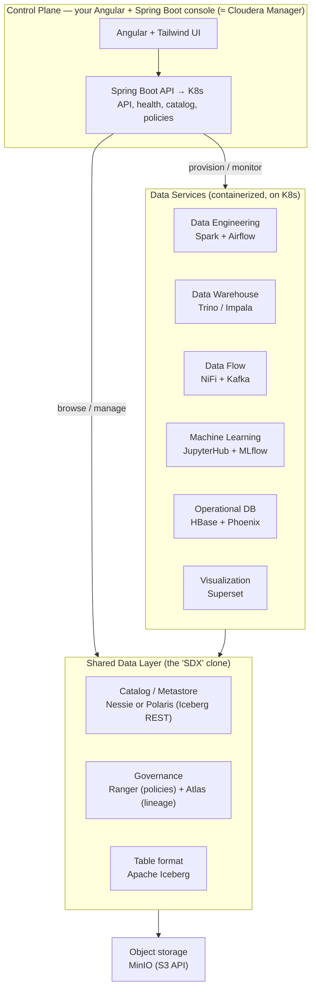

# Open Data Platform — a self-hostable mini-CDP for learning

A Kubernetes-native, fully open-source platform that mirrors Cloudera Data Platform (CDP)
in *shape*, so learners build it, run it, and use the labs to both master the open data
stack and prepare for real Cloudera certifications.

Working name: `@gridatek/open-data-platform` (alt codenames: `openruntime`, `lakeforge`).

---

## Quickstart (one command)

The docker-compose laptop subset brings up the whole stack:

```bash
./bootstrap.sh          # or: make all   (Windows: .\bootstrap.ps1)
make seed               # write the demo Iceberg table
```

| | URL |
|---|---|
| Console (control plane) | http://localhost:8090/api/services · web http://localhost:4200 |
| Superset / Airflow / MLflow | :8088 · :8082 · :5000 |
| Ranger / Atlas / NiFi | :6080 · :21000 · :8095/nifi |

Lighter starts: `make core` (just the lakehouse), `make governance`, `make services`.
Then work the [labs](labs/). For Kubernetes, see the umbrella chart in
[`platform/umbrella`](platform/umbrella/). Each phase is proven by a workflow in
[`.github/workflows`](.github/workflows/).

---

## 1. The core idea (what "follows Cloudera" actually means)

Modern CDP is not "Hadoop". It is two layers:

1. **A shared data + governance layer** — Cloudera calls it SDX (Shared Data Experience):
   one catalog, one security/policy model, one table format that *every* engine reads and
   writes. This is the differentiator. Cloning it is the whole point of the project.
2. **Containerized analytic "data services" on Kubernetes** — Data Engineering, Data
   Warehouse, Data Flow, Machine Learning, Operational DB — each a pluggable experience
   that operates on the same governed data.

A learner becomes a "master" by understanding that *the engines are interchangeable; the
governed shared data layer is the product.* The clone teaches exactly that.

---

## 2. Architecture



---

## 3. The stack: each CDP piece → its open-source equivalent

| Cloudera (CDP) piece            | OSS equivalent in this project          |
|---------------------------------|-----------------------------------------|
| Object storage (S3 / HDFS)      | MinIO                                   |
| Table format                    | Apache Iceberg                          |
| SDX catalog / metastore         | Nessie or Polaris (Iceberg REST), or Hive Metastore |
| SDX governance / lineage        | Apache Ranger + Apache Atlas (or DataHub) |
| CDE — Data Engineering          | Spark + Airflow                         |
| CDW — Data Warehouse            | Trino + Iceberg (or Impala)             |
| CDF — Data Flow / streaming     | NiFi + Kafka                            |
| Cloudera AI / CML               | JupyterHub + MLflow                     |
| Operational Database            | HBase + Phoenix                         |
| Data Visualization              | Apache Superset                         |
| Cluster orchestration / runtime | Kubernetes (Minikube/Kind) + Helm       |
| Cloudera Manager / Mgmt Console | **custom Angular + Spring Boot console**|

The console row is the part only you can build well — it's what makes this a *platform*
project and not "another docker-compose lakehouse".

---

## 4. Repo structure

```
open-data-platform/
├── platform/              # the "Runtime": Helm charts for all OSS services
│   ├── storage/           # MinIO
│   ├── catalog/           # Nessie/Polaris + Hive Metastore
│   ├── governance/        # Ranger + Atlas        ← the SDX clone
│   ├── engineering/       # Spark + Airflow       (≈ CDE)
│   ├── warehouse/         # Trino + Iceberg       (≈ CDW)
│   ├── flow/              # NiFi + Kafka          (≈ CDF)
│   ├── ml/                # JupyterHub + MLflow   (≈ CML)
│   ├── opdb/              # HBase + Phoenix
│   └── viz/               # Superset
├── console/               # control plane (≈ Cloudera Manager)
│   ├── api/               # Spring Boot: K8s client, health, catalog, Ranger admin
│   └── web/               # Angular + Tailwind
├── labs/                  # the curriculum (markdown + sample datasets)
│   ├── 00-generalist/
│   ├── 01-data-engineer/
│   ├── 02-data-analyst/
│   ├── 03-administrator/
│   └── 04-ml-engineer/
├── quickstart/            # laptop subset: docker-compose + kind/minikube bootstrap
└── docs/
```

---

## 5. Phased build roadmap

Build the platform incrementally; each phase is independently usable and demoable.

- **Phase 0 — Lakehouse core.** MinIO + Iceberg + a REST catalog + Trino + Spark.
  One bucket, one Iceberg table, queryable from Trino and writable from Spark. This is the
  spine everything else hangs off.
- **Phase 1 — The SDX clone (the differentiator).** Add Ranger for table/column policies
  and Atlas for lineage over the Phase 0 lakehouse. Prove that a Ranger policy actually
  masks a column in a Trino query. This is what makes it "Cloudera-like".
- **Phase 2 — Console MVP (read-only).** Angular/Spring Boot dashboard: list services and
  health from the K8s API, browse the Iceberg catalog, view Ranger policies. No writes yet.
- **Phase 3 — Breadth of data services.** Add Airflow, NiFi + Kafka, Superset, JupyterHub +
  MLflow as Helm charts, each wired to the shared catalog + governance layer.
- **Phase 4 — Console as control plane.** Console can now provision/scale services and edit
  Ranger policies via the API — the real "Cloudera Manager" experience.
- **Phase 5 — Labs + packaging.** Umbrella Helm chart, one-command bootstrap, and the full
  lab curriculum with cert-alignment callouts.

---

## 6. Learning tracks → real Cloudera certifications

Each track is a folder of hands-on labs on *your* OSS platform, with a callout box per lab:
"On open-source: … / On real CDP: …" — that bridge is how the same project serves both
"master the open stack" and "pass the cert".

| Track | Real cert target | What learners do on the OSS platform |
|-------|------------------|--------------------------------------|
| **00 Generalist** | CDP Generalist (CDP-0011) | Platform concepts, the SDX model, how engines share one governed data layer |
| **01 Data Engineer** | Data Engineer (CDP-3002) | Ingest + transform with Spark, build/maintain Iceberg tables, orchestrate with Airflow |
| **02 Data Analyst** | Data Analyst (CDP-4001) | SQL on Trino/Hive/Impala-analog, Superset dashboards, Ranger column masking, Atlas lineage |
| **03 Administrator** | Administrator (CDP-2001 / 5001) | K8s environments, service lifecycle, Ranger policy admin, audit trails |
| **04 ML Engineer** | ML Engineer (CDP-60xx) | Notebooks in JupyterHub, experiment tracking + model serving with MLflow |

> The CDP Data Analyst exam explicitly tests Hive, Impala, Ranger, Atlas, the Data Warehouse
> and Data Visualization — i.e. the exact OSS components in tracks 02 — so skills transfer
> almost one-to-one. (Verify current exam objectives on Cloudera's site before publishing,
> as codes and weightings change.)

---

## 7. The console — your highest-leverage piece

A Spring Boot API + Angular/Tailwind UI that mirrors Cloudera Manager / Management Console:

- **Service catalog & health** — read the K8s API; show each data service's status, replicas, logs.
- **Data catalog browser** — list Iceberg namespaces/tables via the REST catalog; show schema + snapshots.
- **Governance panel** — view/edit Ranger policies; show Atlas lineage graphs.
- **Provisioning** — create/scale/destroy a data service (apply Helm release or K8s manifests via the API).
- **Multi-environment** — reuse your `@gridatek/nx-supabase` folder-merge idea for env config (dev/staging).

This is the part that makes the project portfolio-grade and genuinely yours.

---

## 8. Suggested next step

Start at **Phase 0** as a single `quickstart/docker-compose.yml` (MinIO + Iceberg REST
catalog + Trino + a Spark job) so contributors get a working lakehouse in one command,
then graduate the same components into Helm charts for the K8s path. Lock the SDX clone
(Phase 1) early — it's the thing that distinguishes this from every other lakehouse demo.